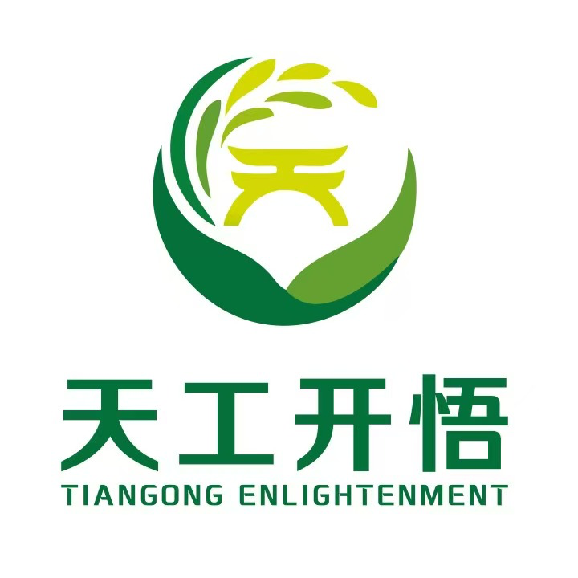

<div align="center">
</img> 
</div>

## 天工开悟-农业多模态大模型(KwooVA)
> **天工不遗，以配万物；开悟不止，以成百谷。**

### 模型简介

**天工开悟-农业多模态大模型（KwooVA）** 是一款专注于农业领域的人工智能多模态模型，融合了图像理解与认知推理的先进技术。基于[MiniCPM-V 2.6](https://github.com/OpenBMB/MiniCPM-V)模型构建，KwooVA深度优化了针对农业场景的专属能力，是**国内首个成功备案的农业类大模型**，标志着智能农业领域的一次重要突破。

KwooVA以**助力农业智能化转型**为使命，核心功能涵盖 **作物病虫害的精准识别、诊断与防治建议**，在农业管理中实现数据驱动的科学决策。通过对开源模型的优化，结合精心构建的农业多模态数据集，KwooVA能够对复杂的农业图像进行深度解析，并提供权威的诊断与防治方案，极大提高了农作物管理的精准性和效率。

我们的模型展现出以下核心特性：

- **领域优化**：基于开源模型深度优化，专注农业场景，能够针对作物病虫害进行精准识别和诊断；

- **知识融合**：构建了农业领域专属数据集，将图像数据与农业知识深度结合，提供智能化的防治建议；

- **高效实用**：聚焦农业实际需求，提供简洁高效的诊断工具，降低技术门槛；

- **技术前沿**：依托先进的多模态技术，实现农业图像与文本数据的智能联动和认知推理。

作为国内农业领域的首个备案大模型，**KwooVA**在农业智能化发展中发挥着先导作用，推动农业生产从经验依赖向科学决策的跨越。未来，我们将持续优化 KwooVA，拓展其应用范围，为智慧农业和可持续发展提供强有力的技术支持！

### 🔥🔥News

- [2024/11/20] **更新了KwooVA的APP使用教程和测试用例**，让用户能够快速上手，充分体验KwooVA在农业生产中的高效性与便捷性，推动智能农业的普及和落地。
- [2024/11/20] **推出了API访问方式**，开发者和企业用户可以轻松集成KwooVA的强大功能，全面赋能农业领域的智能化升级，助力打造多样化、定制化的智慧农业解决方案。
- [2024/10/29] 🎉🎉我们**发布了KwooVA**，为作物病虫害的精准识别、诊断与防治提供了革命性支持！支持[Web端](https://www.tgkwai.com/) 、Android端APP访问(下载APP请点击[这里](#天工开悟app-android版))。

### 数据集收集

在多模态模型的研究中，高质量数据的收集与构建是奠定模型性能与应用价值的基石。在数据准备阶段，本项目广泛收集了国内外农业领域的**30余个权威开源图像数据集**，涵盖了丰富的作物种类及多样化的病虫害类型。通过对数据的严格筛选与精细化处理，最终整理出**26万张高质量图像数据**，为模型的多模态能力打下了坚实的基础。

在图文对齐和指令微调数据集的构建过程中，我们选择了农业领域内具有高度权威性的专业书籍——**《中国农作物病虫害 第3版》** 作为知识来源。这本书系统性地阐述了各种作物病虫害的特征、发生规律以及防治措施，为数据集的专业性提供了权威背书。依托这一知识体系，团队通过GPT-4o生成了**13.6万条图文对齐数据**以及**5万条指令微调多模态数据**。这些数据不仅覆盖了广泛的图像信息，还结合了详尽的文字描述，深度挖掘了多模态语义关联，确保模型训练数据的**科学性、可靠性与实用性**。

图文对齐数据集样例如下：

```json
[
    {
        "id": 0,
        "image": "/images/2S1S24.JPG",
        "conversations": [
            {
                "role": "user",
                "content": "<image>\n这张图的核心是介绍哪种虫害或病害？"
            },
            {
                "role": "assistant",
                "content": "图像中显示的是一片小麦田，多个小麦植株显示出明显的秆锈病症状。这些症状主要集中在小麦的茎秆、叶鞘以及部分叶片上。具体表现为茎秆和叶鞘上有大量褐黄色至深褐色的夏孢子堆，夏孢子堆呈长椭圆形至梭形，排列散乱、无规则，随着病情发展，表皮开裂并向外翻卷，病斑部位的夏孢子向外散发，呈铁锈状。这些孢子堆也出现在叶片正反两面，且叶片反面的孢子堆通常比正面的孢子堆更大。整体来看，植株受害程度较严重，导致生长受到明显影响。"
            }
        ]
    },
  	...
]
```

指令微调数据集样例如下：

```json
[
  	{
        "id": 0,
        "image": "/images/12911_47e5ad77.jpg",
        "conversations": [
          {
            "role": "user",
            "content": "<image>\n针对这种病害，哪些防治方法效果最好？"
          },
          {
            "role": "assistant",
            "content": "针对这种小麦叶锈病，综合防治措施效果最好。首先建议选育和种植抗病品种，例如淮麦21、周麦22等，以增强整体抵抗力。栽培管理方面，收获后翻耕灭茬，适期播种及合理施肥，以减少病菌源和提高植株抗病能力。药剂防治是重要的辅助手段，在秋季可采用三唑酮进行种子拌种，春季叶锈病发生初期，喷洒20%三唑酮乳油1000倍液或43%戊唑醇悬浮剂进行防治，控制病害蔓延。综合措施的应用能有效降低病害发生，减少损失。"
          }
        ]
    },
  	...
]
```

### 训练细节

我们选择了MiniCPM-V-2.6作为基座模型，轻量级、高性能的特点使其成为农业领域多模态大模型的理想选择，在灵活性与可用性之间达到了卓越的平衡。在训练流程设计中，我们参考了MiniCPM-V原始论文中的训练策略，并在四卡80GB的H800 GPU服务器上进行精细化训练。训练过程分为以下两个关键阶段：

1. **预训练阶段（Pre-training）**

在该阶段，我们聚焦于模型的**映射层微调**，以最小化参数调节的方式高效完成图像与文本的语义对齐。通过这一方法，模型能够学习作物病虫害图像与专业文本描述之间的深层语义关系，从而奠定多模态理解能力的基础。

2. **有监督微调阶段（Supervised Fine-tuning）**

为了在增强模型对指令的理解与执行能力的同时，保持其原有的通用性和迁移能力，我们采用了**部分参数解冻策略**，仅开放**映射层与视觉层**进行指令微调。在这一阶段，模型通过与高质量指令数据的交互，进一步优化了跨模态任务处理能力，从而能够更精准地响应用户需求并完成复杂任务。

### 模型效果

经过在高质量对齐数据集上的深度训练，模型不仅能够对作物图片进行**专业化的语义描述**，还具备了**作物分类**、**疾病诊断**与**防治建议生成**的综合能力。这种多模态语义理解能力使得模型能够从视觉数据中提取深层次信息，并将其与农业领域的专业知识无缝融合。通过进一步使用精心设计的微调数据集，模型获得了更为丰富的农学知识，不仅能够准确分析作物疾病的发生规律，还能基于科学依据提供精准且实用的防治建议。

在实际应用场景中，模型展现了**卓越的实用性与可靠性**。它能够帮助农民和农业专家以极高的效率识别作物病虫害，提供实时诊断和针对性的防治策略。这种智能化的农业助手功能，有效提升了农业生产效率，减少了病虫害带来的经济损失，同时也降低了决策中的经验依赖，为农业管理注入了更强的科学性和数据驱动能力。

以下是我们天工开悟APP中多模态推理任务的样例：

<table align="center">
  <tr>
    <td align="center">
      
    </td>
    <td align="center">
      
    </td>
    <td align="center">
      
    </td>
    <td align="center">
      
    </td>
  </tr>
</table>


### 

### API调用

#### 获取访问密钥

登录 [https://www.tgkwai.com/](https://www.tgkwai.com/) 获取 `access token`。

#### 上传图片

允许的附件类型

| 类型名 | 可用后缀名                                          | 最大大小 |
| ------ | --------------------------------------------------- | -------- |
| image  | "jpg", "jpeg", "png", "bmp", "webp"（不区分大小写） | 10MB     |

**请求示例**:

```bash
curl -X POST "https://api.tgkwai.com/api/v1/attachments/upload" \

-H "X-Token: Bearer sk-xxxxxx" \

-F "type=image" \

-F "file=@/path/to/your/image.jpg"
```

#### 创建连接

使用WebSocket创建对话链接，`session_id`是会话号（建议一次对话使用一个session_id）。

```bash
# 如果没有 session_id
wscat -c "wss://api.tgkwai.com/api/v1/qamodel/session?x-token=sk-xxxx"

# 如果有 session_id
wscat -c "wss://api.tgkwai.com/api/v1/qamodel/session?x-token=sk-xxxx&session_id=a8d10ffa-60ba-4af1-916e-6a918c0096e3"
```

#### 发送消息

发送消息时如果可以指定`type`为"multimodal"，即可发送图片。图片路径为上传图片时返回的服务器下的图片路径。

```bash
# 在连接建立后，输入以下 JSON 数据并发送
{
  "session_id": "a8d10ffa-60ba-4af1-916e-6a918c0096e3",
  "messages": [
    {
      "role": "user",
      "type": "multimodal",
      "content": "这张图片里的作物得了什么疾病？",
      "attachments": [
        { "type": "image", "url": "38/image/e72ebf89-f2e9-43d0-b584-5f30e2516ac1.jpg" }
      ]
    }
  ],
  "stream": true
}
```

#### 删除图片

file_path`: 从上传接口获取的附件路径

**请求示例**:

```bash
curl -X DELETE "https://api.tgkwai.com/api/v1/attachments/delete?file_path=38/image/f841828d-709f-4d85-b787-b2ca221233bd.png" \

-H "X-Token: Bearer sk-xxxxxx"
```

[API详细说明文档](KwooVa-API使用指南.md)

### TODO List

- [ ] 增加更多作物和病虫害的高质量数据集，覆盖更加广泛的农业场景
- [ ] 优化模型的计算效率与资源占用，探索更加轻量化、高效的模型结构
- [ ] 提升模型在复杂场景下的预测精度和稳健性

### 项目参与者

本项目参与成员：王好天、刘卓然、孟繁舒、孙习迈、王首力、罗会宾、乔畅。

指导老师：姜京池副教授、关毅教授以及刘劼教授。

### 天工开悟APP (Android版)

欢迎大家扫描下方二维码下载**天工开悟APP**进行体验。

使用方法：第一步，打开APP，输入**邀请码(8t6nwq)** 进入登录页面，随后切换到“密码登录”页面输入账号、密码并勾选同意协议选项进行登录。第二步，登录后进入问答页面，在下方输入框中输入想要询问的问题，等待回答。

<div align="center">


</div>
### 致谢

我们的工作受到以下工作的启发，在此对项目成员表示诚挚的感谢。

- MiniCPM-V: https://github.com/OpenBMB/MiniCPM-V

